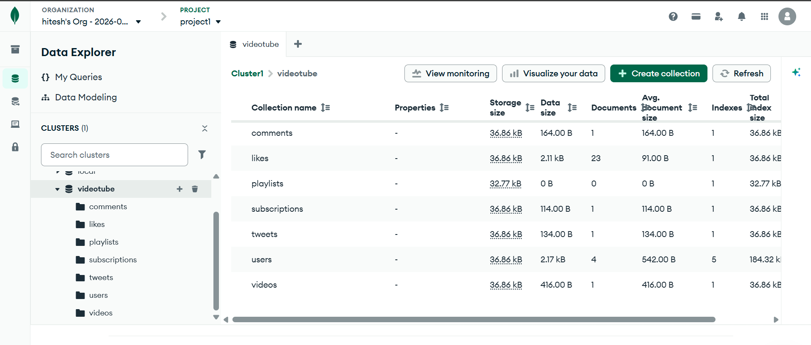
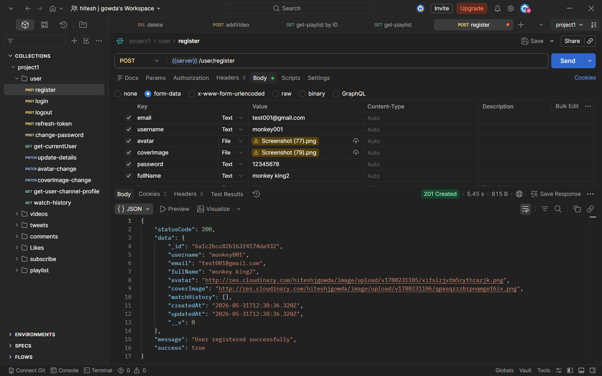
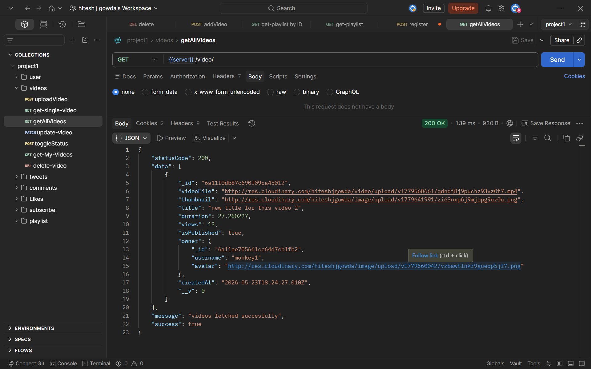

# VideoTube Backend

VideoTube is a YouTube-style backend API built from scratch using Node.js, Express, MongoDB, JWT, Cloudinary, Multer, and Mongoose. It covers the core creator workflow: user authentication, video upload, comments, likes, subscriptions, tweets, playlists, and watch history.

I built this project for learning production grade backend skills and tested the major flows in Postman.

## Live References

- Architecture / model diagram: [Eraser model link](https://app.eraser.io/workspace/zoDE9XF583aw9uyiLNfi?origin=share&diagram=B2QskPe1fUDFA8-6XaOix)
- Postman collection: [View collection](https://hiteshjgowda13-5059342.postman.co/workspace/hitesh-j-gowda's-Workspace~0f38c0eb-0e0b-48e6-8849-034183e130b7/collection/54450181-69b7ebce-fe83-4459-a529-e5622c7eba33?action=share&source=copy-link&creator=54450181)

## Features

- User registration, login, logout, token refresh, and password change
- Upload video with thumbnail through Multer and Cloudinary
- Update video details, toggle publish status, and delete videos
- Fetch all published videos and a single video by ID
- Add, update, delete, and fetch comments with pagination
- Like and unlike videos, comments, and tweets
- Create, update, and delete tweets
- Subscribe and unsubscribe to channels
- Create playlists, add or remove videos, update playlist details, delete playlists, and toggle playlist visibility
- View watch history and channel profile details
- and other minor features.

## Tech Stack

- Node.js
- Express.js
- MongoDB
- Mongoose
- JWT
- Cloudinary
- Multer
- bcrypt
- cookie-parser
- cors

## Project Structure

- `src/app.js` sets up middleware and route mounting
- `src/index.js` starts the server and connects to MongoDB
- `src/controllers/` contains business logic
- `src/routes/` contains API route definitions
- `src/models/` contains MongoDB schemas
- `src/middlewares/` contains auth and upload middleware
- `src/utils/` contains helper classes and functions

## Setup

1. Install dependencies.
2. Create your `.env` file with the required values(refer `.env.example`)
3. Start MongoDB.
4. Run the server.

### Example

```bash
npm install
npm run dev
```

## Environment Variables

Create a `.env` file in the project root with values similar to these:

```env
PORT=8000
MONGODB_URL=your_mongodb_connection_string
CORS_ORIGIN=*
ACCESS_TOKEN_SECRET=your_access_token_secret
ACCESS_TOKEN_EXPIRY=1d
REFRESH_TOKEN_SECRET=your_refresh_token_secret
REFRESH_TOKEN_EXPIRY=10d
CLOUDINARY_CLOUD_NAME=your_cloud_name
CLOUDINARY_API_KEY=your_api_key
CLOUDINARY_API_SECRET=your_api_secret
```

## API Modules

- `/api/v1/user`
- `/api/v1/video`
- `/api/v1/comment`
- `/api/v1/tweets`
- `/api/v1/Likes`
- `/api/v1/subscribe`
- `/api/v1/playlist`

## Testing

All major endpoints were tested in Postman and verified manually.


## Screenshots

These images are stored in the `results/` folder:

- Database collections: `results/db.png`
- Test case 1: `results/t1.png`
- Test case 2: `results/t2.png`








## Notes

- The project uses protected routes for authenticated actions.
- Playlist visibility is handled with a public/private flag.
- Delete operations and ownership checks are enforced at the controller level.
